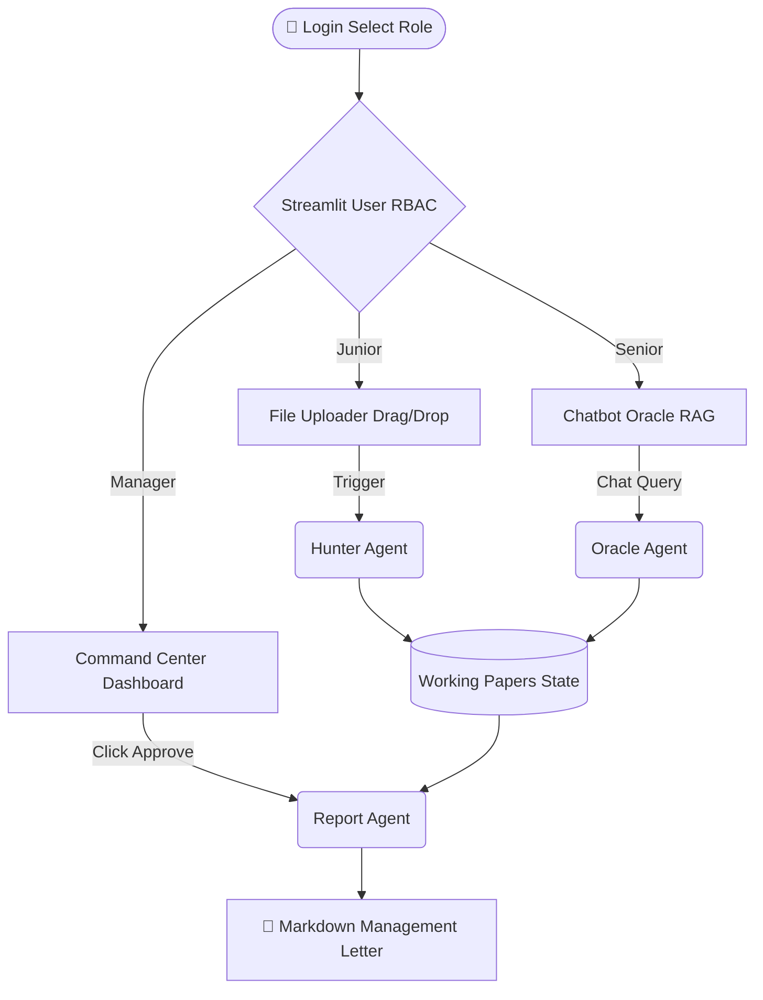

<div align="center">
  <h1>⚖️ TaxLens-AI: Open-Core Edition</h1>
  <h3>The Ultimate 3-Headed Enterprise AI Auditor</h3>
  <p>
    
    
    
    
  </p>
</div>

---

**TaxLens-AI** marks its definitive pivot into an **Enterprise Open-Core Product**, engineered specifically for international Big 4 audit firms (e.g., Forvis Mazars). We have aggressively decoupled operations into a unified Role-Based Access Control (RBAC) architecture orchestrated by a 3-Headed LangGraph Agent system.

## 🚀 The 3 Pillars of Power (Core Features)

1. **🛡️ Thợ Săn Lỗi (Hunter Agent - Junior Level)**
   - **Mục Định:** Đóng vai trò Data Cruncher.
   - **Sức Mạnh:** Tiêu thụ hàng loạt file báo cáo khổng lồ (Sổ cái, Trial Balance, XML Invoices). Áp dụng thuật toán đối chiếu siêu tốc (VAT, CIT, FCT/Transfer Pricing) mà không sập hệ thống.
2. **🧠 Từ Điển Sống (Oracle Agent - Senior Level)**
   - **Mục Định:** Khám phá Luật Thuế Real-time.
   - **Sức Mạnh:** Xóa bỏ khái niệm Vector Database tốn dung lượng ổ đĩa. Sử dụng **Stealth RAG Cổng Thông Tin Chính Phủ VN**. Nó bẻ gãy Cloudflare 403 bằng `fake-useragent` và retry thông minh để đem về các phân tích từ LLM sống trên Ram.
3. **✒️ Máy In Báo Cáo (Report Agent - Manager Level)**
   - **Mục Định:** Khâu ấn định dòng tiền và danh dự pháp lý của Big 4.
   - **Sức Mạnh:** Dựa vào nút bấm duy nhất của Manager (PHÊ DUYỆT), tự động sinh chuỗi **Management Letter** đẹp tiêu chuẩn, gãy gọn mọi rủi ro với phong cách văn bản pháp lý cứng cáp.

## 🏗️ 3-Headed RBAC Architecture



## ⚡ Quick Start

```bash
# Cài đặt siêu tân binh
pip install -r requirements.txt

# Khởi động RBAC UI (nhớ điền API Key vào Sidebar)
streamlit run frontend/app.py
```

*Built by Antigravity as the Ultimate Startup Tax Blueprint.*
