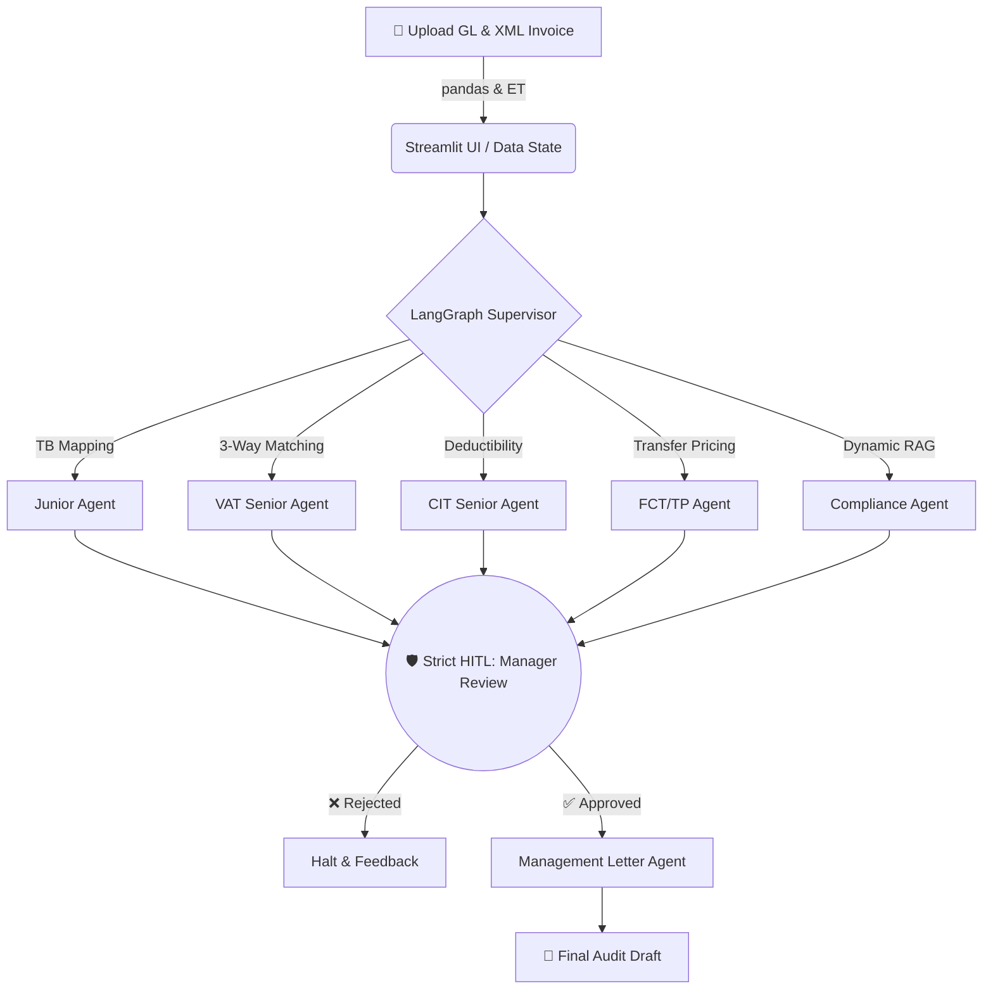

<div align="center">
  <h1>⚖️ TaxLens-AI</h1>
  <h3>Enterprise Autonomous Tax Brain – 100% Local, 0% Data Leak</h3>
  <p>
    
    
    
    
  </p>
</div>

---

**TaxLens-AI** marks its **Commit 100 Milestone** by evolving into a flawless Big 4-standard agentic workspace. It leverages LangGraph to orchestrate a team of local AI audit agents that actively scan Vietnamese General Ledgers and E-Invoices, grounded perfectly in current tax laws without ever sending a single byte to the internet.

## 🏗️ System Architecture & Execution Flow



## 🌟 Masterpiece Features
- **Strict Human-In-The-Loop (HITL):** LangGraph utilizes `interrupt_before=["Manager_Review_Node"]` to completely pause the AI orchestration thread. Data cannot proceed to reporting without explicit human approval.
- **Dynamic Vietnamese Law RAG:** Say goodbye to hallucination. Powered by LlamaIndex, the Compliance Agent forces explicit citations (`Theo [Văn bản] - Điều [X]`) or defaults to `Insufficient legal basis`.
- **Fault-Tolerant XML Parser:** A deeply robust XML scanner strips chaotic Vietnamese E-Invoice namespaces on the fly to seamlessly pull `<MST>`, `<ThTien>`, and `<TGTGT>`.
- **Crash-Proof Enterprise State:** Multi-tab Streamlit dashboard (`st.tabs`) combined with robust backend memory check-pointing prevents state loss even if the user refreshes mid-review.

## 🚀 Quickstart (Zero-Setup)

**1. Install & Setup Environment**
```bash
python -m venv .venv
# Activate venv: source .venv/bin/activate (mac/linux) OR .venv\Scripts\activate (windows)
pip install -r requirements.txt
```

**2. Start Local Intelligence (Ollama)**
```bash
# Ensure Ollama is installed locally
ollama pull llama3.1
ollama pull nomic-embed-text
```

**3. Launch the Enterprise Workspace**
```bash
streamlit run frontend/app.py
```
> Wait for the UI to load, drop your `CSV/XLSX` Ledgers and `XML` Invoices on the left panel, and command the Agent to begin the audit!

---
*Developed by Antigravity as the Ultimate Tax AI Reference Standard.*
